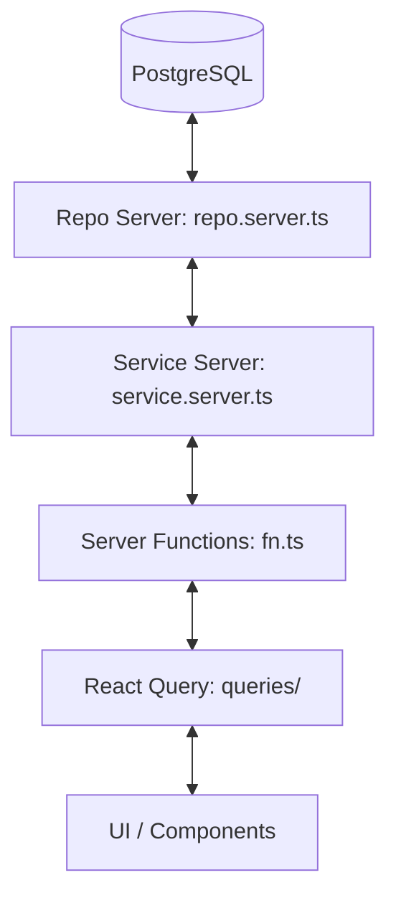

# Berkah Amanah - Codebase Agent Guide

Welcome, Agent! This document provides a comprehensive overview of the **Berkah Amanah** codebase. It outlines the architecture, technology stack, directory layout, database schema, authentication flow, and development guidelines to help you understand and contribute to this project efficiently.

---

## 🚀 Technology Stack

This application is built using a modern, fast, and type-safe JavaScript/TypeScript stack:

- **Runtime & Package Manager**: [Bun](https://bun.sh/)
- **Meta-Framework**: [TanStack Start](https://tanstack.com/start) (React 19, Vite, Nitro Server)
- **Routing**: [TanStack Router](https://tanstack.com/router) (File-based, Type-safe Routing)
- **Data Fetching & Cache**: [TanStack Query](https://tanstack.com/query) (React Query v5)
- **Database & ORM**: PostgreSQL via `postgres` driver and [Drizzle ORM](https://orm.drizzle.team/)
- **Authentication**: [Better Auth](https://www.better-auth.com/) (Username and Admin plugins enabled)
- **Styling**: [Tailwind CSS v4](https://tailwindcss.com/) (using the `@tailwindcss/vite` compiler plugin)
- **UI Components**: [shadcn/ui](https://ui.shadcn.com/) (components styled with Tailwind v4 & Class Variance Authority)
- **Linting & Formatting**: [Oxlint](https://github.com/oxc-project/oxc) and [Oxfmt](https://github.com/oxc-project/oxc) (incredibly fast Rust-based tools)

---

## 📁 Directory Structure

The project follows a modular, feature-driven structure under `src/`:

```
berkah-amanah/
├── .agents/                  # Agent-specific custom instructions & skills (e.g. shadcn)
├── public/                   # Static assets
├── src/
│   ├── components/           # Shared UI primitives (shadcn components, breadcrumbs, sidebar, etc.)
│   ├── database/             # Database connection & schemas
│   │   ├── schema/           # Table schemas (auth.ts, kelompok.ts)
│   │   ├── index.ts          # Drizzle client initialization
│   │   └── relations.ts      # Table relationship definitions
│   ├── feature/              # Feature modules (Domain Driven)
│   │   ├── auth/             # Login, register containers, mutations, and schemas
│   │   └── kelompok/         # Kelompok-related logic, services, queries, and server actions
│   ├── hooks/                # Global React hooks
│   ├── lib/                  # Shared library configs (Better Auth configuration, client, env, utils)
│   ├── routes/               # File-based routes (TanStack Router)
│   │   ├── _auth/            # Guest-only routes layout and guards
│   │   ├── api/              # API endpoints (including catch-all for auth server)
│   │   ├── dashboard/        # Authenticated dashboard layout, sidebar, and views
│   │   └── __root.tsx        # Base root shell (HTML document setup, Devtools, Toaster)
│   ├── router.tsx            # TanStack Router configuration
│   ├── styles.css            # Global CSS (Tailwind directive imports)
│   └── routeTree.gen.ts      # Autogenerated route tree (DO NOT EDIT manually)
├── drizzle.config.ts         # Drizzle migration and configuration
├── package.json              # Dependencies and scripts
└── tsconfig.json             # TypeScript configuration (includes #/* alias mappings)
```

---

## 🛠️ Architecture & Data Flow Pattern

For feature logic (under `src/feature/<domain>`), the project strictly adheres to a **layered architecture** to keep the client and server code clean and separated. Always follow this structure when adding new feature domains:



1. **Repository Layer (`*.repo.server.ts`)**:
   Direct database access using Drizzle ORM.
   _Example:_ `KelompokRepo.getOptionsKelompok()` queries the database.
2. **Service Layer (`*.service.server.ts`)**:
   Handles business logic, validations, and mapping database rows to UI-friendly shapes.
   _Example:_ Maps the raw database output of groups to `{ label: name, value: id }`.
3. **Server Functions (`fn.ts`)**:
   Exposes service methods to the client using TanStack Start's `createServerFn`. This boundaries the server-client logic.
   _Example:_ `getOptionsKelompokFn` runs on the server but is imported and called on the client.
4. **Queries & Mutations Layer (`queries/`)**:
   Wraps server functions in TanStack Query (`queryOptions` or mutations) to manage UI caching, loading, and error states.
   _Example:_ `getOptionsKelompokQueryOptions` uses the server function as the query executor.
5. **Component/View Layer**:
   Uses the query options/mutations inside standard React components or router loaders for type-safe rendering.

---

## 🔐 Authentication & Authorization

Authentication is powered by **Better Auth** with a Drizzle adapter.

### Database Schema

- **User Table (`user`)**: Contains basic credentials (`email`, `username`, `password` via `account`), user metadata (`role`, `displayUsername`), and a foreign key constraint linking to the `kelompok` table (`idKelompok`).
- **Default Role**: Set to `"daerah"` in `src/lib/auth.ts`.

### Guards & Session Handling

We use `getSession` and `ensureSession` server functions in `src/lib/auth-function.ts` to manage auth state in the router layout hooks:

- **Guest-only (`src/routes/_auth/route.tsx`)**:
  Protects landing/login pages. If a session exists, the user is redirected to `/dashboard`.
- **Protected (`src/routes/dashboard/route.tsx`)**:
  Protects the dashboard. Checks `beforeLoad: async () => { ... }`. If no session is found, redirects back to root `/`.

---

## ✍️ Coding Guidelines & Style Rules

### 1. Import Path Aliases

Always use the subpath import alias `#/*` to import anything under `src/`. Do **not** use relative paths like `../../components/ui/button`.

- **Right**: `import { db } from "#/database"`
- **Wrong**: `import { db } from "../../database"`

### 2. File-Based Routing

- Place new pages inside `src/routes/`.
- TanStack Router automatically tracks changes and updates the route definitions.
- If the compiler does not pick up new routes immediately, execute `bun run generate-routes`.

### 3. Database Schema Changes

- Define new tables inside `src/database/schema/` (use snake_case tables with `snakeCase.table` wrapper).
- Export schemas in `src/database/schema/index.ts`.
- Define relationships in `src/database/relations.ts`.
- Apply local schema changes directly to the PostgreSQL database with:
  ```bash
  bun run db:push
  ```

### 4. Code Formatting

- Do not run custom Prettier scripts. We use `oxlint` and `oxfmt`.
- Keep the lint check green before checking in code:
  ```bash
  bun run lint
  ```

---

## 📋 Common Developer Commands

Use these commands during development:

| Command                   | Action / Purpose                                                    |
| :------------------------ | :------------------------------------------------------------------ |
| `bun install`             | Install all dependencies                                            |
| `bun --bun run dev`       | Start the local development server at `http://localhost:3000`       |
| `bun run generate-routes` | Force run the TanStack Router CLI code generator                    |
| `bun run lint`            | Run Oxlint checker and fix trivial styling errors                   |
| `bun run format`          | Run Oxfmt autoformatter on the codebase                             |
| `bun run db:push`         | Sync the Drizzle schema directly with the database                  |
| `bun run db:studio`       | Open Drizzle Studio database explorer                               |
| `bun run build`           | Compile the application into a production bundle using Vite & Nitro |
